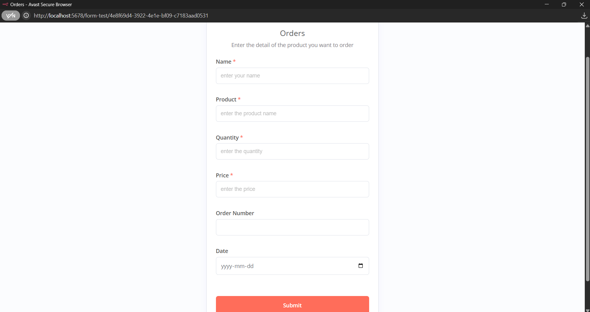

# Airtable Customer Booking

_A simple and intuitive tool to collect customer booking requests, store them in Airtable, and send confirmation emails._

## 📌 Project Flow Overview

1. **User fills out booking form**  
   Users provide details like name, email, date, and other relevant info via a clean web form.  
   

2. **Data sent to Airtable**  
   Submitted booking requests are saved in a structured Airtable base for easy tracking and updates.  
   

3. **Automated email confirmation**  
   After submitting, users receive a confirmation email with booking details.  
   

4. **Workflow orchestration**  
   The entire process—from form submission to email dispatch—is managed via N8N automation workflow.  
   

---

